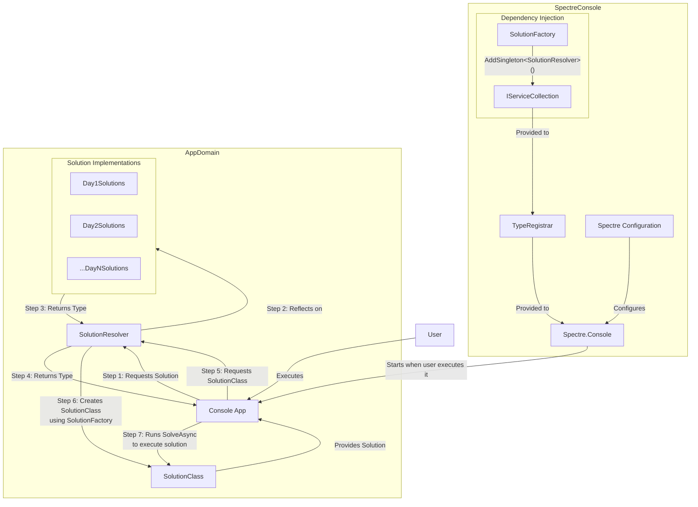

# Advent of Code 2024

Prerequisites: Dotnet 9

## Q: Why the language change? <br/>
A: Over the past year I've been doing a lot of work in dotnet as part of my job, and as I've learned dotnet and C# I've
come to really love the language.
It seems so much more intuitive than JS/TS, and it being compiled down to IL Code it's fast. Not as fast as Rust or C++,
but very, very close.

## What about the other languages? <br/>
2023, which I didn't finish, was in TypeScript. It became difficult to work certain puzzles as TypeScript, while
strongly typed, is still JS and has some of the same issues.
With dotnet, I have access to things like LINQ, which is a godsend for some of these puzzles. That is my very
unprofessional opinion™️.

## How in the world do I run these? <br/>
Clone the repo, `cd` into the `2024/AoC2024` folder, and run
`dotnet run`. This command can be slow if it hasn't been built or restored yet.
You can run `dotnet build` separately, and then call `dotnet run --no-build --no-restore`, and it should be much faster

## Can I create solutions with this? <br/>
Sure can! Clone the repo, `cd` into the `2024/AoC2024` folder, and run
`dotnet run` or `dotnet run scaffold`. Similarly to the question above, running `dotnet build` separately will speed it up for future runs.

By default, the application runs `dotnet run -- run` if you don't provide any arguments. The `run` command will attempt to find a solution for today's day and year
If it can't, it will ask you if you want to scaffold a solution. Selecting yes will generate a `AoCDay{currentDay}.cs` file in the `Solutions\{currentYear}` folder.

You can manually specify years, days, parts, and the input file for `run`. The syntax is `run [year] [day] [part] [input.txt file path]`. 
By default, year and day are today's date, part is 1, and the input path is `Solutions\{currentYear}\input.txt`. 
The scaffold command is the same, minus the part and input path parameters, which don't exist. The location of the input.txt file download is `Solutions\{currentYear}\input.txt`.

You need to set the `SESSION` environment variable to your session cookie. You can get this from your browser. 
In Firefox, hit F12, go to "Storage", select "Cookies", and the session cookie should be there. Then, just set it to the session environment var in your shell. These cookies are good for about a month.

```powershell
# Powershell
$env:SESSION = "12345"
```

```bash
# Bash
export SESSION = "12345"
```

```bat
REM Command Prompt
set SESSION=12345
```

## How does this even work? <br/>
I'm using `Spectre.Console` for the input. `Spectre.Console` is initialized with a default command
(`var app = new CommandApp<RunCommand>(registrar);`). When doing this, you don't have to pass a command name in.

The `Spectre.Console` `app` also takes in a TypeRegistrar, which is a special class implementing an Interface from
`Spectre.Console.Cli` which basically holds the IServiceCollection with all our dependencies. Internally Spectre calls
this
to create its own "registrar" of services to provide to commands.

Part of this DI container is our `SolutionResolver`. The `SolutionResolver` uses reflection to find the correct class
with an
`AdventSolutionAttribute` and the correct day and part parameters within the attribute. These classes _should_, if done
properly, implement `IAdventSolution`, which requires a `SolveAsync` method.

The `SolutionResolver` then calls the `SolutionFactory` to build the class with all necessary dependencies, then calls
that `SolveAsync` method via Reflection.

Is it stupidly complicated? Yes. Does it allow me to literally just add a class with that attribute and boom, it works?
Also yes. Doing it this way made it extremely easy to add new solutions as time goes on.

Here's a _**very**_ rough Mermaid chart of how this works:


